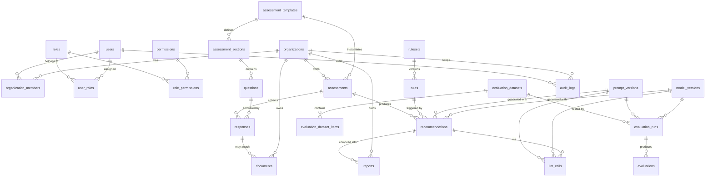

# Entity-Relationship Model

**Status:** Design baseline (Phase 3)
Canonical DDL: [`db/schema.sql`](../../db/schema.sql). This document explains the
*shape* and the *reasoning*; the SQL is the source of truth.

Design rules followed here:

- **Model for the AI features we know are coming** (eval, prompt/model versioning,
  pgvector) without over-normalizing today.
- **JSONB where the schema is genuinely dynamic** (assessment definitions,
  rule conditions, LLM output) — relational everywhere the shape is stable.
- **Tenant scoping is explicit:** every tenant-owned table carries
  `organization_id`. Isolation is enforced in the repository layer, not left to
  query discipline. See [ADR-0006](../adr/0006-multi-tenancy-isolation.md).
- **Audit & soft-delete:** `created_at`/`updated_at` everywhere; `deleted_at` where
  recovery or audit matters; `audit_logs` is append-only.

---

## Overview diagram

---

## Entity reference

### Identity & access

| Table | Purpose | Key fields / notes |
|---|---|---|
| `users` | A person. Auth credentials are managed by the auth provider; this is the app-side profile. | `email` (unique, citext), `email_verified_at`, `status`, `deleted_at` (soft). PII minimized. |
| `roles` | RBAC roles: `admin`, `consultant`, `org_user`. | seed data; `name` unique. |
| `permissions` | Fine-grained capabilities (e.g. `report:publish`). | future-proofs RBAC beyond 3 roles. |
| `role_permissions` | M:N roles↔permissions. | |
| `user_roles` | Role assignment, **scoped to an organization** where relevant. | `(user_id, role_id, organization_id)`. A user can be `consultant` globally but `org_user` in a specific org. |

> **Why `user_roles` is org-scoped:** a consultant operates across tenants; an org
> user is bound to one. Putting `organization_id` on the assignment (nullable for
> global roles) models both without a separate table per role type.

### Organizations (tenancy root)

| Table | Purpose | Notes |
|---|---|---|
| `organizations` | The tenant boundary. Everything tenant-owned references this. | `slug` unique, `deleted_at` soft. |
| `organization_members` | Membership + invitation lifecycle. | `status` (`invited`/`active`/`removed`), `invited_by`, `invite_token_hash`, `invite_expires_at`. Tokens stored hashed. |

### Assessment engine

| Table | Purpose | Notes |
|---|---|---|
| `assessment_templates` | A **versioned, reusable assessment definition** for a category. | `category` enum (ai_readiness, data_maturity, security, governance, compliance, operations, infrastructure), `version`, `status` (draft/published/archived). Dynamic structure lives in child tables + JSONB. |
| `assessment_sections` | Ordered sections within a template. | `order_index`, `title`. |
| `questions` | A question within a section. | `type` enum (text, long_text, number, single_select, multi_select, file_upload), `config` JSONB (options, min/max, required, validation), `order_index`, `key` (stable identifier used by rules). |
| `assessments` | An **instance**: an org completing a template. | `organization_id`, `template_id`, `status` (in_progress/completed/...), `completed_at`, `assignee_id`. Pins `ruleset_version_id` at completion. |
| `responses` | One answer to one question in one assessment. | `value` JSONB (typed per question), `(assessment_id, question_id)` unique. JSONB because the value shape varies by question type. |
| `documents` | Uploaded files (PDF/DOCX) attached to responses or orgs. | `storage_key` (object store), `mime_type`, `byte_size`, `sha256`, `scan_status` (pending/clean/infected), `original_filename`. **Never** stored in a public path. |

> **Why JSONB for `questions.config` and `responses.value`:** the assessment schema
> is genuinely dynamic and authored by consultants. Forcing it into columns would
> mean a migration per question type. JSONB keeps the engine flexible; the stable
> bits (type, key, ordering) stay relational so rules and queries are sane. See
> [ADR-0008](../adr/0008-postgres-jsonb-pgvector.md).

### Rule engine

| Table | Purpose | Notes |
|---|---|---|
| `rulesets` | A **named, versioned collection** of rules. Assessments pin a ruleset version. | `version`, `status`, `published_at`. Versioning makes results reproducible. |
| `rules` | One deterministic rule. | `ruleset_id`, `category`, `severity`, `condition` JSONB (safe boolean expression tree), `recommendation_template` JSONB (title, body, references), `is_active`, `priority`. **Editable without deploy.** |

### Recommendations & reports

| Table | Purpose | Notes |
|---|---|---|
| `recommendations` | A finding produced by the rule engine, optionally LLM-enhanced. | `assessment_id`, `rule_id` (traceability), `category`, `severity`, `status` (draft/edited/approved/rejected), deterministic fields + LLM narrative fields, `prompt_version_id`, `model_version_id`, `grounding_passed`. Edited by consultants (audited). |
| `reports` | A compiled, published deliverable. | `organization_id`, `assessment_id`, `status` (draft/published), `pdf_storage_key`, `published_by`, `published_at`, `content` JSONB snapshot (immutability of what was published). |

> **Why `recommendations` carries both deterministic *and* LLM fields plus
> `prompt_version_id`/`model_version_id`/`grounding_passed`:** this single row tells
> the full story — what the rule decided, what the LLM said, which prompt+model
> produced it, and whether it passed the grounding check. That is the reproducibility
> and audit backbone. See [ADR-0003](../adr/0003-rule-engine-then-llm.md) &
> [ADR-0005](../adr/0005-evaluation-framework.md).

### AI versioning & telemetry

| Table | Purpose | Notes |
|---|---|---|
| `prompt_versions` | Versioned prompt templates. | `name`, `version`, `template`, `variables` JSONB, `is_active`. Recommendations & eval runs reference a specific version. |
| `model_versions` | A model as configured (id, params) + **pricing** for cost accounting. | `provider`, `model_id` (e.g. routed via OpenRouter), `params` JSONB, `input_cost_per_1k`, `output_cost_per_1k`, `is_active`. |
| `llm_calls` | One LLM invocation: the observability/cost record. | `recommendation_id` (nullable), `prompt_version_id`, `model_version_id`, `latency_ms`, `input_tokens`, `output_tokens`, `cost_estimate`, `status`, `correlation_id`. Append-only telemetry. |

### Evaluation framework

| Table | Purpose | Notes |
|---|---|---|
| `evaluation_datasets` | A named, versioned set of test cases (gold inputs + expected findings). | enables regression testing. |
| `evaluation_dataset_items` | One case: input fixture + expected deterministic findings + acceptable narrative constraints. | `input` JSONB, `expected` JSONB. |
| `evaluation_runs` | One execution of a dataset against a (prompt_version, model_version). | `dataset_id`, `prompt_version_id`, `model_version_id`, `status`, aggregate scores. Compare runs ⇒ regression detection. |
| `evaluations` | Per-item result within a run. | `metrics` JSONB (accuracy, consistency, completeness, hallucination, grounding), `passed`. |

### Cross-cutting

| Table | Purpose | Notes |
|---|---|---|
| `audit_logs` | Append-only record of security-relevant actions. | `actor_user_id`, `organization_id`, `action`, `entity_type`, `entity_id`, `metadata` JSONB, `ip`, `created_at`. No updates/deletes. |

---

## Indexing & constraints (highlights)

- Every tenant-owned table: index on `organization_id`; composite indexes on
  `(organization_id, status)` for the common dashboard queries.
- `responses (assessment_id, question_id)` unique — one answer per question.
- `documents.sha256` indexed for dedupe; `scan_status` indexed (a document with
  `scan_status != 'clean'` is never servable).
- `recommendations (assessment_id, category)` for report compilation.
- `llm_calls (created_at)` + `(model_version_id, created_at)` for cost rollups.
- pgvector: an `embedding vector(N)` column is provisioned on a future
  `knowledge_chunks` table (designed, not yet created) with an HNSW/IVFFlat index —
  see [ADR-0008](../adr/0008-postgres-jsonb-pgvector.md). **Not built**, but the
  extension is enabled and the seam is reserved so RAG/semantic-search land cleanly.

---

## What is deliberately *not* modeled yet

Per the brief — design the extension points, don't build them:

- **RAG / knowledge base** (`knowledge_chunks`, embeddings) — seam reserved, pgvector enabled.
- **Agent workflow state / memory** — would land as `agent_runs` / `agent_steps`;
  the worker + Celery topology already supports multi-step orchestration.
- **HITL review queue** — partially expressed today via `recommendations.status` and
  consultant approval; a dedicated `review_tasks` table is the natural extension.

Reserving these as named seams (rather than building speculative tables) is the
point: the model is ready to grow without being bloated now.
