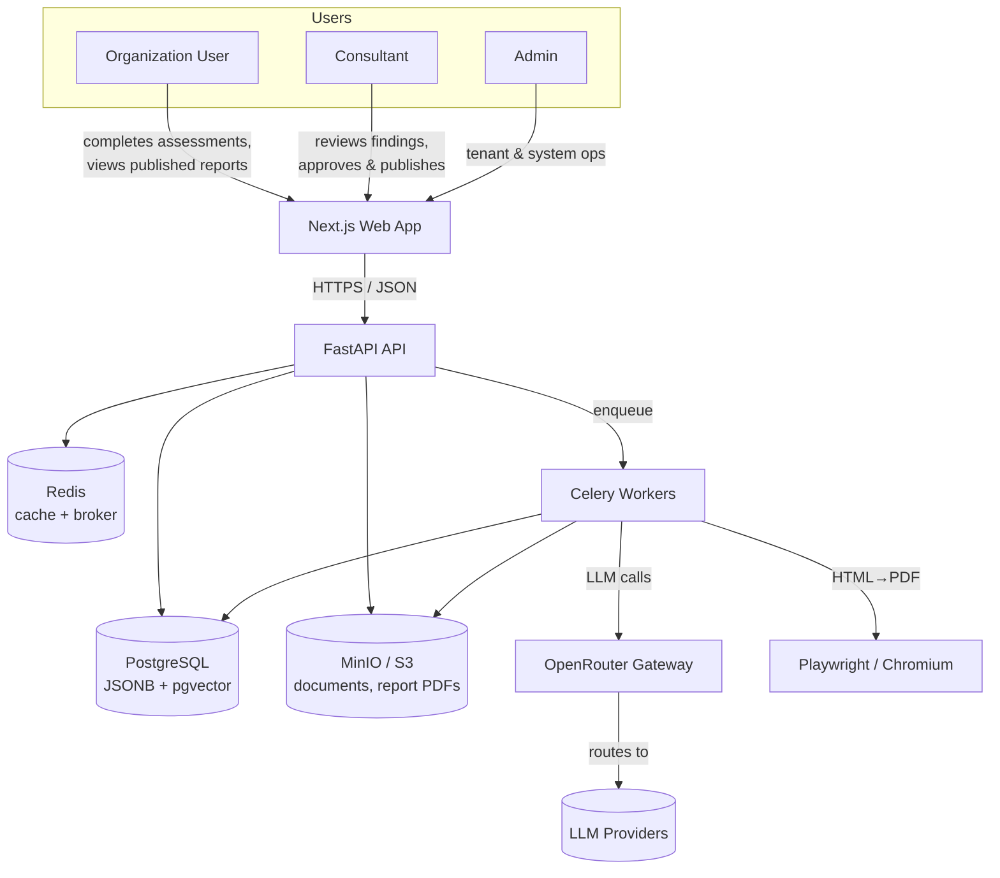
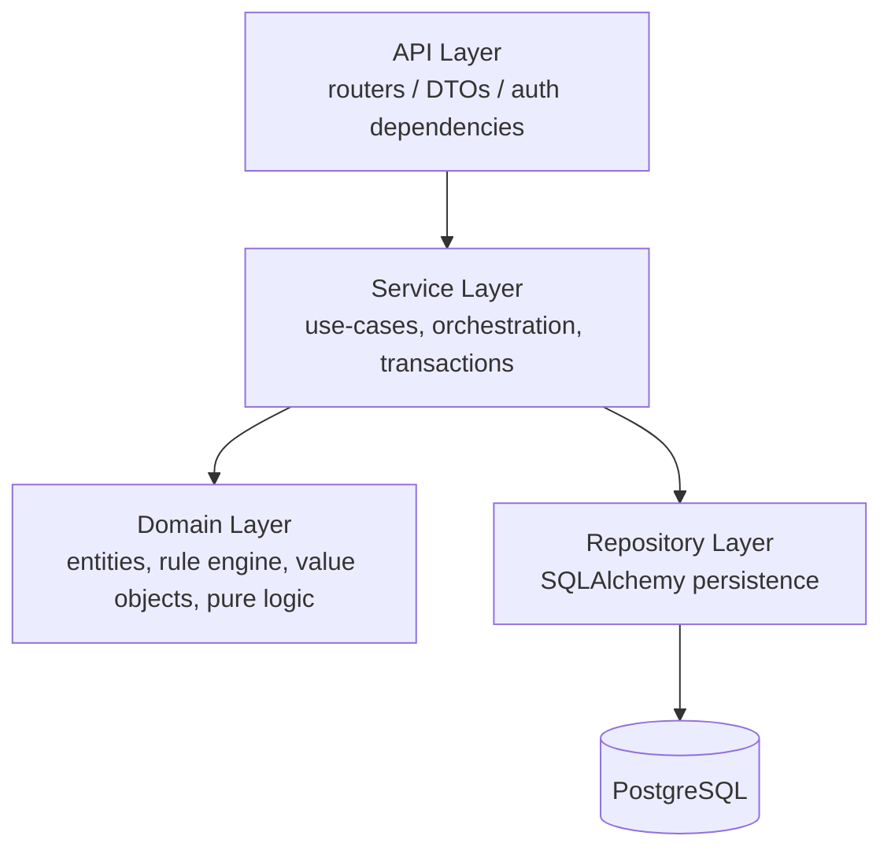
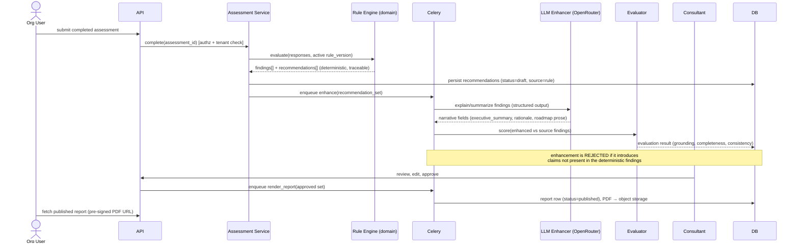
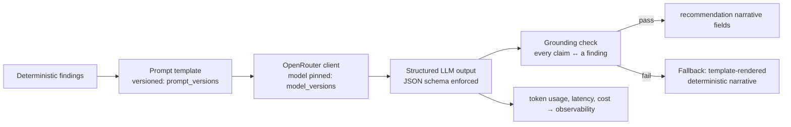

# System Architecture

**Status:** Design baseline (Phase 2)
**Audience:** Engineers and reviewers evaluating the system design.

This document describes the shape of the AI Advisory Platform: its containers, its
internal layering, the request and AI data flows, and the cross-cutting concerns
(security, observability, multi-tenancy). Decisions referenced here are recorded in
[ADRs](../adr/).

---

## 1. Context (who talks to the system)



The web app is a thin client. **All authorization, business logic, and AI
orchestration live behind the API.** The browser is never trusted.

---

## 2. Containers and responsibilities

| Container | Responsibility | Notes |
|---|---|---|
| **web** (Next.js) | UI, session handling, client validation (Zod), data fetching (React Query) | No business rules. Mirrors server validation only for UX. |
| **api** (FastAPI) | AuthN/Z, request validation, orchestration, synchronous reads/writes | Layered (below). Stateless; scales horizontally. |
| **worker** (Celery) | Long/expensive work: LLM enhancement, evaluation runs, PDF rendering, malware-scan hooks | Same domain/service code as the API, different entrypoint. |
| **postgres** | System of record. Relational core + JSONB for dynamic schemas + pgvector for future RAG | See [ADR-0008](../adr/0008-postgres-jsonb-pgvector.md). |
| **redis** | Response/idempotency cache, rate-limit counters, Celery broker + result backend | |
| **minio/s3** | Uploaded documents and generated PDFs, outside any public path | Pre-signed, time-boxed access only. |
| **openrouter** | Single egress point for all LLM traffic | See [ADR-0004](../adr/0004-openrouter-llm-gateway.md). |

Why a separate worker tier: LLM calls and PDF rendering are *slow and bursty*
(seconds to tens of seconds). Keeping them out of the request path protects API
latency and lets the two tiers scale independently. The API enqueues a job and the
client polls a job/resource status — see §4.

---

## 3. Internal layering (inside `api` and `worker`)

We use a strict four-layer dependency flow. Each layer only depends on the one
below it. See [ADR-0002](../adr/0002-layered-architecture.md).



```
app/
├── api/            # FastAPI routers. HTTP only. Parse → authorize → call service → serialize.
│   ├── deps.py     #   DI: current_user, db session, tenant context, role guards
│   └── v1/         #   versioned routers (auth, orgs, assessments, rules, reports, eval, admin)
├── services/       # Use-cases. Transaction boundaries. No HTTP, no SQL strings.
├── domain/         # Pure business logic. NO I/O.
│   ├── rules/      #   the deterministic rule engine + evaluator
│   ├── scoring/    #   readiness/maturity scoring
│   └── models/     #   domain entities & value objects (not ORM)
├── repositories/   # Persistence. The ONLY place SQLAlchemy is touched.
├── llm/            # OpenRouter client, prompt templates (versioned), enhancement pipeline
├── eval/           # Evaluation framework: metrics, datasets, runners
├── observability/  # tracing, metrics, cost accounting, structured logging
├── infra/          # config, db engine/session, storage client, redis, celery app
└── schemas/        # Pydantic v2 request/response DTOs (the API contract types)
```

**The rules that keep this honest:**

- Routers contain no business logic — they parse, authorize, delegate, serialize.
- Services contain no SQL and no `Request`/`Response` objects.
- The domain layer imports nothing from `api`, `repositories`, `infra`, or `llm`.
  It is pure and unit-testable with no database. The rule engine lives here.
- Dependency injection (FastAPI `Depends`) wires sessions, tenant context, and the
  current principal. Nothing reaches into globals.

This boundary is what lets the rule engine be tested exhaustively and the LLM layer
be swapped or mocked without touching business logic.

---

## 4. The core flow: assessment → recommendation → report



Key properties of this flow:

- **The rule engine is the source of truth.** Recommendations exist and are
  persisted *before* any LLM call. If the LLM is down, the assessment still yields a
  complete, if less polished, result.
- **The LLM enhances named fields only** (summaries, rationale, roadmap prose). It
  is given the findings as structured input and asked to *explain*, not *decide*.
- **Every enhancement is evaluated for grounding** before it can be surfaced — the
  evaluator checks that the narrative does not assert findings absent from the
  deterministic set. This is the primary hallucination control. See
  [ADR-0005](../adr/0005-evaluation-framework.md).
- **A human approves** before anything is published (consultant-in-the-loop).

---

## 5. AI Recommendation Layer



Design commitments:

- **Prompts are versioned data** (`prompt_versions`), not hardcoded strings. A
  recommendation records *which* prompt version and *which* model version produced
  it — full reproducibility and A/B-able regression.
- **Output is schema-constrained** (Pydantic/JSON schema). The LLM returns fields we
  ask for; free-form prose is bounded.
- **There is always a deterministic fallback.** If the LLM fails, times out, or fails
  the grounding check, the report uses a template-rendered narrative from the rule
  output. The system never *requires* the LLM to function.
- **Extension points (designed, not built):** the `llm/` package and pgvector are
  positioned so RAG, semantic search over prior assessments, agentic multi-step
  workflows, and memory can be added without re-architecting. See
  [ADR-0008](../adr/0008-postgres-jsonb-pgvector.md) and
  [portfolio-story.md](../portfolio-story.md#extension-points).

---

## 6. Rule Engine

The rule engine is **database-driven**: rules live in the `rules` table, not in
code, and are editable without a deployment ([Module 4 requirement](../portfolio-story.md)).

- A rule is `{ when: condition-tree, then: recommendation-template, category, severity, version }`.
- Conditions are a small, **safe, non-Turing-complete** boolean expression tree over
  assessment responses and derived facts (e.g. `mfa_enabled == false AND sensitive_data == true`).
  We deliberately do **not** `eval()` user-supplied code — see
  [threat-model](../security/threat-model.md) (injection) and
  [ADR-0003](../adr/0003-rule-engine-then-llm.md).
- Rules are **versioned as a set** (`rule_version`). An assessment is evaluated
  against a *pinned* rule version, so results are reproducible and audit-stable even
  as rules evolve.
- The evaluator is pure domain code: `(responses, ruleset) → findings`. Fully unit
  testable, no I/O, the backbone of the evaluation framework's regression tests.

---

## 7. Observability

Observability is built in, not bolted on. Every LLM interaction and every request is
measured.

| Signal | Captured where | Stored / exported |
|---|---|---|
| Request latency, status, route | API middleware | metrics + structured log |
| LLM latency, model, tokens (in/out), **estimated cost** | `llm/` client wrapper | `recommendations` + `llm_calls` rows, metrics |
| Evaluation scores (grounding, completeness, consistency, hallucination rate) | `eval/` runners | `evaluations`, `evaluation_runs` |
| Cost per org / per assessment / per model | aggregation views | admin dashboard |
| Errors (sanitized) | global handler | structured log + alert signal |
| Audit events (who did what to what) | service layer | `audit_logs` (append-only) |

Cost is computed from token counts × per-model rates kept in `model_versions`, so the
**Admin dashboard can show spend by org, by model, and by time** — the operational
view that distinguishes a real AI system from a demo. Traces tie web → api → worker →
LLM with a single correlation id.

---

## 8. Security posture (summary)

Full detail in [security-review](../security/security-review.md) and
[threat-model](../security/threat-model.md). Headlines:

- **Default-deny authorization.** Every endpoint declares its required role and
  tenant scope; the default is refusal. RBAC roles: Admin, Consultant, Org User.
- **Hard multi-tenant isolation.** Tenant id is derived from the authenticated
  principal (never from the request body) and applied at the repository layer to
  *every* query. See [ADR-0006](../adr/0006-multi-tenancy-isolation.md).
- **Auth is not hand-rolled** — Auth.js/Better Auth, with refresh-token rotation,
  session invalidation, email verification, password reset. See
  [ADR-0007](../adr/0007-auth-choice.md).
- **Input validation** at the edge (Zod client-side, Pydantic server-side), request
  **size limits**, **rate limiting** (Redis), **secure headers**, **error
  sanitization** (never leak stack traces), **audit logging**.
- **File uploads** validated by extension *and* MIME, size-bounded, stored outside
  public paths, with a malware-scan integration point before a document is usable.
- **Sensitive fields encrypted at rest**; PII minimized; soft deletes where recovery
  or audit matters.

---

## 9. Scaling & failure behavior

- **API and workers scale horizontally**; both are stateless. Postgres is the
  coordination point; Redis carries ephemeral state.
- **LLM is an external dependency and is treated as unreliable:** timeouts,
  retries with backoff, circuit-break to the deterministic fallback. An LLM outage
  degrades *polish*, not *function*.
- **Worker isolation** means a slow PDF render or a stuck LLM call cannot consume API
  request capacity.
- **Idempotency:** assessment completion and report generation are keyed so retries
  don't double-charge LLM spend or produce duplicate reports.
