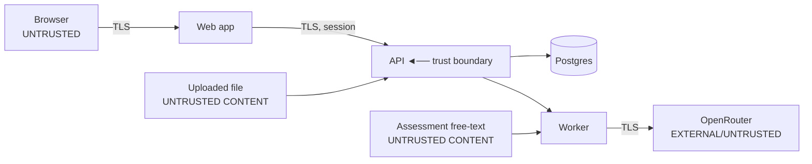

# Threat Model (STRIDE)

**Status:** Design baseline
**Method:** STRIDE over the system's trust boundaries and data flows.
**Companion:** control inventory in [security-review.md](security-review.md).

## Assets (what an attacker wants)

| Asset | Why it matters |
|---|---|
| Tenant assessment data, documents, reports | Confidential org intelligence; cross-tenant leak is the worst outcome. |
| Recommendations & their integrity | Wrong/forged advice damages the buyer and the product's credibility. |
| Credentials & sessions | Account takeover ⇒ everything above. |
| `OPENROUTER_API_KEY` & other secrets | Direct financial loss + abuse. |
| Audit logs | Tampering hides attacker activity. |
| LLM spend / compute | Cost-based abuse (DoW — denial of wallet). |

## Trust boundaries

The browser, uploaded files, assessment free-text, and the LLM/OpenRouter are all
**untrusted**. The API is the primary trust boundary.

---

## STRIDE analysis

### S — Spoofing (identity)

| Threat | Mitigation |
|---|---|
| Credential stuffing / brute force | Managed auth library; rate-limit + lockout on auth endpoints; strong hashing (ADR-0007). |
| Session hijacking | httpOnly+Secure+SameSite cookies; short access tokens; **refresh-token rotation with reuse detection** revokes the session family. |
| Forged invitation acceptance | Invite tokens stored **hashed**, single-use, time-boxed (`organization_members`). |
| Password-reset token theft | Hashed, single-use, time-boxed; reset invalidates sessions. |

### T — Tampering (integrity)

| Threat | Mitigation |
|---|---|
| **SQL injection** | No string-built SQL; SQLAlchemy parameterization only; input validated by Pydantic. |
| **Rule-condition injection** (rules are data, editable without deploy) | Conditions are a **safe boolean expression tree** evaluated by a sandboxed interpreter — **never `eval()`/`exec()`**. The interpreter has a fixed operator set and no I/O (ADR-0003). Rule edits are RBAC-gated and audited. |
| Client tampering with tenant id / role / price | All derived server-side from the session; never read from request body (ADR-0006/0007). |
| Tampering with published reports | `reports.content` is an immutable JSONB snapshot at publish; PDF stored under opaque key; changes require a new report + audit entry. |
| Audit-log tampering | Append-only; app DB role lacks UPDATE/DELETE on `audit_logs`. |
| Mass-assignment | DTOs are explicit Pydantic models; no blind ORM `**kwargs`. |

### R — Repudiation

| Threat | Mitigation |
|---|---|
| "I didn't publish/approve/edit that" | Append-only `audit_logs` capture actor, action, entity, ip, time for all sensitive actions (publish, approve, rule edit, role change, member changes). |
| LLM action denial / opacity | `llm_calls` records every model invocation (model, prompt version, tokens, cost, correlation id); recommendations record which prompt+model produced them. |

### I — Information disclosure  *(highest priority)*

| Threat | Mitigation |
|---|---|
| **Cross-tenant data access** (IDOR, broken object-level authz) | Defense in depth: tenant context from session + central repository scoping + **Postgres RLS (implemented, enforced via a non-superuser `app_role`)**. Mandatory cross-tenant test suite (ADR-0006). |
| Stack traces / internal errors leaking schema or paths | Global error handler returns generic message + correlation id; details to logs only. |
| Direct object reference to documents/reports | No public paths; access via short-lived pre-signed URLs **after** authorization; storage keys opaque. |
| **Prompt-injection-driven data exfiltration** (malicious assessment text instructs the LLM to leak) | Prompts contain only the current assessment's findings — **no secrets, no cross-tenant data** is ever in context, so there is nothing to exfiltrate. Single monitored egress. Output is data, not actions. |
| Sensitive data in logs | Input redaction in the LLM client; PII minimized; structured logging with field allowlists. |
| Verbose enumeration (user/org existence via timing or messages) | Uniform auth responses; constant-ish handling of "exists/doesn't." |

### D — Denial of Service / Denial of Wallet

| Threat | Mitigation |
|---|---|
| Request flooding | Redis rate limits per principal + IP; request size limits; gateway-level limits. |
| **Denial of Wallet** (forcing expensive LLM calls) | Per-org LLM budgets + rate limits; idempotency keys prevent retry-driven double spend; deterministic fallback path is cheap; `llm_calls` telemetry alerts on anomalies. |
| Expensive uploads / zip-bomb-style files | Size limits pre/intra-stream; only PDF/DOCX; scan-before-process. |
| Worker starvation | Worker tier isolated from API; bounded queues; slow LLM/PDF can't consume request capacity. |

### E — Elevation of privilege

| Threat | Mitigation |
|---|---|
| Org user acting as consultant/admin | Default-deny RBAC; role from session; per-route guards; CI asserts every route is guarded (ADR-0007). |
| Horizontal escalation across orgs | Same as cross-tenant (Information disclosure) — both-must-pass role + tenant checks. |
| **Malicious file upload → code execution** | **Implemented:** extension + MIME + magic-byte validation (spoofed/renamed files rejected), size limits, the **malware-scan gate** (`scan_status` must be `clean` before download), opaque keys outside web roots, content never executed/rendered in a trusted context. |
| **Stored XSS via LLM or user text in the report → PDF** | Report content is treated as untrusted data; HTML is escaped/sanitized before render; Playwright renders in an isolated, network-restricted context; strict CSP on the web app. |
| SSRF via OpenRouter/storage/document fetch | No user-controlled outbound URLs; egress allowlist (OpenRouter, storage); document fetching is by internal storage key, not URL. |

---

## Residual risk & assumptions

- **Trusts the auth library** to correctly implement sessions/credentials — chosen
  precisely so we don't implement that ourselves (ADR-0007). We track its advisories.
- **Trusts OpenRouter** as an external processor; mitigated by the structural blast-
  radius limit (LLM can't change findings) and by sending no secrets/cross-tenant
  data. A formal data-processing assessment of the provider precedes production.
- **Malware scanner is an integration point**, not implemented here; the *gate* (no
  use before `clean`) is designed in so wiring a scanner is the only remaining step.
- **Edge protections (WAF/bot management)** are environment concerns, noted in the
  security review as deferred.

## Highest-priority controls (if you fix only a few things)

1. Cross-tenant isolation (repository scoping **+** RLS **+** test suite).
2. Default-deny RBAC with the "every route is guarded" CI check.
3. The rule-condition sandbox (no `eval`) — because rules are editable data.
4. Report/PDF output sanitization (LLM + user text → trusted render).
5. LLM cost guardrails (denial-of-wallet).
